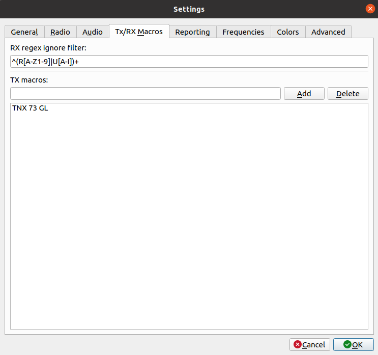
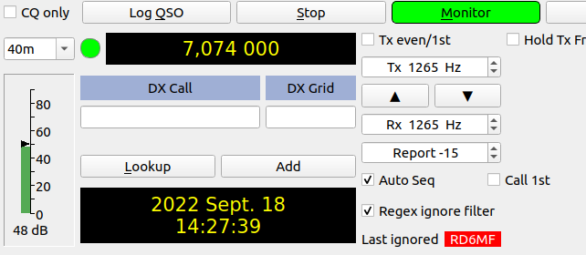

# WSJT-X 2.5.4 - Regex ignore filter 

In order to apply this change just overwrite contents of root and `widgets/` 
folders. To find out what has changed execute a diff or search for `SP6XD` 
comments in the source code.

## Features
- Added option: Setup -> RX/TX Macros -> RX regex ignore filter

- CQ answers from matched callsigns are ignored
- reply to CQ from matched callsigns are ignored
- Manual clicks (calls) to matched stations are ignored

Just like that. Tested during WW DIGI contest.

## Note

I have to confess that I'm not a software developer and this patch is just 
a dirty hack to make it possible to make auto QSO with all except Russians.
To filter out RU stations use this filter: **^(R[A-Z1-9]|U[A-I])+** 

I know that this is not part of "ham spirit" to make such a software but...
let's face it. One does not simply attack its neighbour and expects others
to stay quiet. As a Pole I know my country has long and cloudy history with 
both Russians and Ukrainians,but what happened in the past should stay in the past.
One may remember, one may forget, one may cry for revenge or one my simply forgive.
From my perspective, we live in 2022, Europe, in the times of wide spread Internet.
Suddenly war explodes at the borders of my country. The war that makes no sense,
pure aggression and disgusting act of terrorism. As long as regular Russians do not 
resist to their goverment I would act and make software like this, no matter what.

Bartek SP6XD
